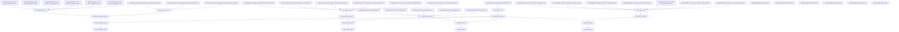

```mermaid
flowchart TD
	node1["../data/raw/Attendance_Oct14-May15_to_Warwick.xlsx.dvc"]
	node2["../data/raw/Attendance_Oct15-May16_to_Warwick.xlsx.dvc"]
	node3["../data/raw/Attendance_Oct16-May17_to_Warwick.xlsx.dvc"]
	node4["../data/raw/Attendance_Oct17-May18_to_Warwick.xlsx.dvc"]
	node5["../data/raw/Attendance_Oct18-Jan20_to_Warwick.xlsx.dvc"]
	node6["../data/raw/Attendance_Oct20-May22_to_Warwick.xlsx.dvc"]
	node7["../data/raw/Bucks_Secondary_School_2022.xlsx.dvc"]
	node8["../data/raw/KS4_2015_Hard_Coded.csv.dvc"]
	node9["../data/raw/KS4_2016_Hard_Coded.csv.dvc"]
	node10["../data/raw/KS4_2017_Hard_Coded.csv.dvc"]
	node11["../data/raw/KS4_2018_Hard_Coded.csv.dvc"]
	node12["../data/raw/KS4_2019_Hard_Coded.csv.dvc"]
	node13["../data/raw/NEET_MI_Feb16_with_YPID_to_Warwick.xlsx.dvc"]
	node14["../data/raw/NEET_MI_Feb17_with_YPID_to_Warwick.xlsx.dvc"]
	node15["../data/raw/NEET_MI_Feb18_with_YPID_to_Warwick.xlsx.dvc"]
	node16["../data/raw/NEET_MI_Feb19_with_YPID_to_Warwick.xlsx.dvc"]
	node17["../data/raw/NEET_MI_Feb20_with-YPID_to_Warwick.xlsx.dvc"]
	node18["../data/raw/NEET_MI_Feb21_with_YPID_to_Warwick.xlsx.dvc"]
	node19["../data/raw/NEET_MI_Feb22_with_YPID_to_Warwick.xlsx.dvc"]
	node20["../data/raw/school_census_attendance_Aut21_Hard_Coded.xlsx.dvc"]
	node21["../data/raw/school_census_attendance_Spr21_Hard_Coded.xlsx.dvc"]
	node22["../data/raw/school_census_attendance_Sum21_Hard_Coded.xlsx.dvc"]
	node23["../data/raw/school_census_context_Jan17_Hard_Coded.xlsx.dvc"]
	node24["../data/raw/school_census_context_Jan18_Hard_Coded.xlsx.dvc"]
	node25["../data/raw/school_census_context_Jan19_Hard_Coded.xlsx.dvc"]
	node26["../data/raw/school_census_context_Jan20_Hard_Coded.xlsx.dvc"]
	node27["../data/raw/school_census_context_Jan21_Hard_Coded.xlsx.dvc"]
	node28["../data/raw/school_census_context_Jan22_Hard_Coded.xlsx.dvc"]
	node29["annotate_attendance_data"]
	node30["annotate_census_data"]
	node31["annotate_ks4_data"]
	node32["annotate_neet_data"]
	node33["canonicalize_attendance_data"]
	node34["canonicalize_census_data"]
	node35["canonicalize_ks4_data"]
	node36["canonicalize_neet_data"]
	node37["canonicalize_school_info"]
	node38["census_data_to_csv"]
	node39["merge_attendance_data"]
	node40["merge_census_data"]
	node41["merge_ks4_data"]
	node42["merge_neet_data"]
	node43["new_attendance_to_csv"]
	node44["new_neet_to_csv"]
	node45["old_attendance_to_csv"]
	node46["school_info_to_csv"]
	node1-->node43
	node2-->node43
	node3-->node43
	node4-->node43
	node5-->node43
	node6-->node43
	node7-->node46
	node8-->node35
	node9-->node35
	node10-->node35
	node11-->node35
	node12-->node35
	node13-->node44
	node14-->node44
	node15-->node44
	node16-->node44
	node17-->node44
	node18-->node44
	node19-->node44
	node20-->node45
	node21-->node45
	node22-->node45
	node23-->node38
	node24-->node38
	node25-->node38
	node26-->node38
	node27-->node38
	node28-->node38
	node29-->node39
	node30-->node40
	node31-->node41
	node32-->node42
	node33-->node29
	node34-->node30
	node35-->node31
	node36-->node32
	node37-->node29
	node37-->node30
	node37-->node31
	node37-->node32
	node38-->node34
	node43-->node33
	node44-->node36
	node45-->node33
	node46-->node37
	node47["../data/raw/FEB22_NEET_MI.xlsx.dvc"]
	node48["../data/raw/FEB20_NEET_MI.xlsx.dvc"]
	node49["../data/raw/FEB19_NEET_MI.xlsx.dvc"]
	node50["../data/raw/FEB21_NEET_MI.xlsx.dvc"]
	node51["../data/raw/FEB18_NEET_MI.xlsx.dvc"]
	node52["../data/raw/data_codes.csv.dvc"]
```
