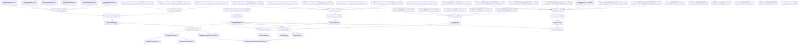

```mermaid
flowchart TD
	node1["../data/raw/Attendance_Oct14-May15_to_Warwick.xlsx.dvc"]
	node2["../data/raw/Attendance_Oct15-May16_to_Warwick.xlsx.dvc"]
	node3["../data/raw/Attendance_Oct16-May17_to_Warwick.xlsx.dvc"]
	node4["../data/raw/Attendance_Oct17-May18_to_Warwick.xlsx.dvc"]
	node5["../data/raw/Attendance_Oct18-Jan20_to_Warwick.xlsx.dvc"]
	node6["../data/raw/Attendance_Oct20-May22_to_Warwick.xlsx.dvc"]
	node7["../data/raw/Bucks_Secondary_School_2022.xlsx.dvc"]
	node8["../data/raw/KS4_2015_Hard_Coded.csv.dvc"]
	node9["../data/raw/KS4_2016_Hard_Coded.csv.dvc"]
	node10["../data/raw/KS4_2017_Hard_Coded.csv.dvc"]
	node11["../data/raw/KS4_2018_Hard_Coded.csv.dvc"]
	node12["../data/raw/KS4_2019_Hard_Coded.csv.dvc"]
	node13["../data/raw/NEET_MI_Feb16_with_YPID_to_Warwick.xlsx.dvc"]
	node14["../data/raw/NEET_MI_Feb17_with_YPID_to_Warwick.xlsx.dvc"]
	node15["../data/raw/NEET_MI_Feb18_with_YPID_to_Warwick.xlsx.dvc"]
	node16["../data/raw/NEET_MI_Feb19_with_YPID_to_Warwick.xlsx.dvc"]
	node17["../data/raw/NEET_MI_Feb20_with-YPID_to_Warwick.xlsx.dvc"]
	node18["../data/raw/NEET_MI_Feb21_with_YPID_to_Warwick.xlsx.dvc"]
	node19["../data/raw/NEET_MI_Feb22_with_YPID_to_Warwick.xlsx.dvc"]
	node20["../data/raw/school_census_attendance_Aut21_Hard_Coded.xlsx.dvc"]
	node21["../data/raw/school_census_attendance_Spr21_Hard_Coded.xlsx.dvc"]
	node22["../data/raw/school_census_attendance_Sum21_Hard_Coded.xlsx.dvc"]
	node23["../data/raw/school_census_context_Jan17_Hard_Coded.xlsx.dvc"]
	node24["../data/raw/school_census_context_Jan18_Hard_Coded.xlsx.dvc"]
	node25["../data/raw/school_census_context_Jan19_Hard_Coded.xlsx.dvc"]
	node26["../data/raw/school_census_context_Jan20_Hard_Coded.xlsx.dvc"]
	node27["../data/raw/school_census_context_Jan21_Hard_Coded.xlsx.dvc"]
	node28["../data/raw/school_census_context_Jan22_Hard_Coded.xlsx.dvc"]
	node29["annotate_attendance_data"]
	node30["annotate_census_data"]
	node31["annotate_ks4_data"]
	node32["annotate_neet_data"]
	node33["attendance_annual_exact"]
	node34["attendance_annual_percent1"]
	node35["attendance_annual_percent2"]
	node36["attendance_normalized_term_averaged"]
	node37["canonicalize_attendance_data"]
	node38["canonicalize_census_data"]
	node39["canonicalize_ks4_data"]
	node40["canonicalize_neet_data"]
	node41["canonicalize_school_info"]
	node42["census_categorical"]
	node43["census_data_to_csv"]
	node44["ks2_categorical"]
	node45["merge_attendance_data"]
	node46["merge_census_data"]
	node47["merge_ks4_data"]
	node48["merge_multi_upn_attendance_term_normalized"]
	node49["merge_neet_data"]
	node50["neet_categorical"]
	node51["new_attendance_to_csv"]
	node52["new_neet_to_csv"]
	node53["old_attendance_to_csv"]
	node54["school_info_to_csv"]
	node1-->node51
	node2-->node51
	node3-->node51
	node4-->node51
	node5-->node51
	node6-->node51
	node7-->node54
	node8-->node39
	node9-->node39
	node10-->node39
	node11-->node39
	node12-->node39
	node13-->node52
	node14-->node52
	node15-->node52
	node16-->node52
	node17-->node52
	node18-->node52
	node19-->node52
	node20-->node53
	node21-->node53
	node22-->node53
	node23-->node43
	node24-->node43
	node25-->node43
	node26-->node43
	node27-->node43
	node28-->node43
	node29-->node33
	node29-->node36
	node30-->node42
	node30-->node50
	node31-->node44
	node33-->node34
	node33-->node35
	node36-->node48
	node37-->node45
	node38-->node46
	node39-->node47
	node40-->node49
	node41-->node29
	node41-->node30
	node41-->node31
	node41-->node32
	node42-->node48
	node43-->node38
	node44-->node48
	node45-->node29
	node46-->node30
	node47-->node31
	node49-->node32
	node50-->node48
	node51-->node37
	node52-->node40
	node53-->node37
	node54-->node41
	node55["../data/raw/FEB22_NEET_MI.xlsx.dvc"]
	node56["../data/raw/FEB20_NEET_MI.xlsx.dvc"]
	node57["../data/raw/FEB19_NEET_MI.xlsx.dvc"]
	node58["../data/raw/FEB21_NEET_MI.xlsx.dvc"]
	node59["../data/raw/FEB18_NEET_MI.xlsx.dvc"]
	node60["../data/raw/data_codes.csv.dvc"]
```
